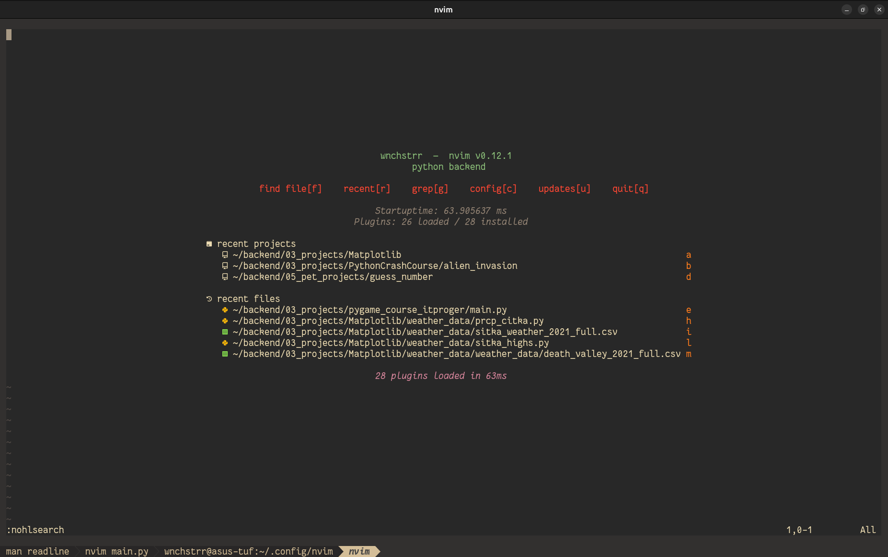

# nvim-config

Личный конфиг Neovim для Python бэкенд-разработки. Построен с нуля на `lazy.nvim` и встроенном LSP API Neovim 0.11+.




---

## Структура

```
~/.config/nvim/
├── init.lua
└── lua/
    ├── config/
    │   ├── options.lua    настройки редактора
    │   ├── keymaps.lua    горячие клавиши
    │   └── lazy.lua       менеджер плагинов
    └── plugins/
        ├── ui.lua         тема, lualine, bufferline
        ├── editor.lua     neo-tree, telescope, treesitter, surround
        ├── lsp.lua        mason, pyright, nvim-cmp
        └── tools.lua      gitsigns, which-key, toggleterm, conform
```

---

## Плагины

| Плагин              | Назначение                               |
|---------------------|------------------------------------------|
| `lazy.nvim`         | Менеджер плагинов с ленивой загрузкой    |
| `everforest`        | Тема                                     |
| `lualine`           | Строка статуса                           |
| `bufferline`        | Вкладки файлов сверху                    |
| `neo-tree`          | Файловый менеджер                        |
| `telescope`         | Fuzzy поиск по файлам и тексту           |
| `nvim-treesitter`   | Подсветка синтаксиса                     |
| `nvim-surround`     | Обёртка в кавычки, скобки                |
| `mason`             | Менеджер LSP серверов                    |
| `nvim-lspconfig`    | Подключение LSP                          |
| `nvim-cmp`          | Автодополнение                           |
| `pyright`           | LSP для Python                           |
| `gitsigns`          | Git изменения в строках                  |
| `indent-blankline`  | Линии отступов                           |
| `which-key`         | Подсказки клавиш                         |
| `toggleterm`        | Встроенный терминал                      |
| `conform` + `ruff`  | Форматтер Python при сохранении          |

---

## Keymaps

Leader клавиша — `Space`.

### Файлы и буферы

| Клавиша      | Действие                   |
|--------------|----------------------------|
| `Space+e`    | Файловый менеджер          |
| `Space+ff`   | Поиск файлов               |
| `Space+fg`   | Поиск текста в файлах      |
| `Space+fb`   | Поиск по буферам           |
| `Space+s`    | Сохранить                  |
| `Space+q`    | Закрыть                    |
| `Space+bd`   | Закрыть буфер              |
| `Space+r`    | Запустить Python файл      |
| `Tab`        | Следующий буфер            |
| `Shift+Tab`  | Предыдущий буфер           |

### LSP

| Клавиша      | Действие                   |
|--------------|----------------------------|
| `gd`         | Перейти к определению      |
| `K`          | Документация               |
| `gr`         | Все использования          |
| `Space+rn`   | Переименовать              |
| `Space+ca`   | Быстрые действия           |
| `Space+d`    | Показать ошибку            |

### Git

| Клавиша      | Действие                   |
|--------------|----------------------------|
| `Space+gp`   | Предпросмотр изменений     |
| `Space+gb`   | Git blame строки           |
| `Space+gr`   | Сбросить изменения         |

### Сплиты

| Клавиша        | Действие                 |
|----------------|--------------------------|
| `Ctrl+h/l/j/k` | Переключение сплитов     |

### Терминал

| Клавиша   | Действие                   |
|-----------|----------------------------|
| `Ctrl+\`  | Открыть/закрыть терминал   |

### Insert mode

| Клавиша   | Действие                   |
|-----------|----------------------------|
| `jj`      | Выход в Normal mode        |
| `Ctrl+c`  | Выход в Normal mode        |

---

## Установка

Убедись что установлен Neovim 0.11+:

```bash
nvim --version
```

Клонируй конфиг:

```bash
git clone git@github.com:wnchstrr/nvim-config.git ~/.config/nvim
```

Запусти `nvim` — `lazy.nvim` автоматически скачает все плагины, а `mason` установит `pyright` и `ruff` для Python.

---

## Окружение

- **ОС:** Ubuntu 24.04
- **Терминал:** Kitty
- **Шрифт:** Fantasque Sans Mono Nerd Font
- **Shell:** zsh
- **Тема:** Everforest Dark Hard

---

## License

MIT
